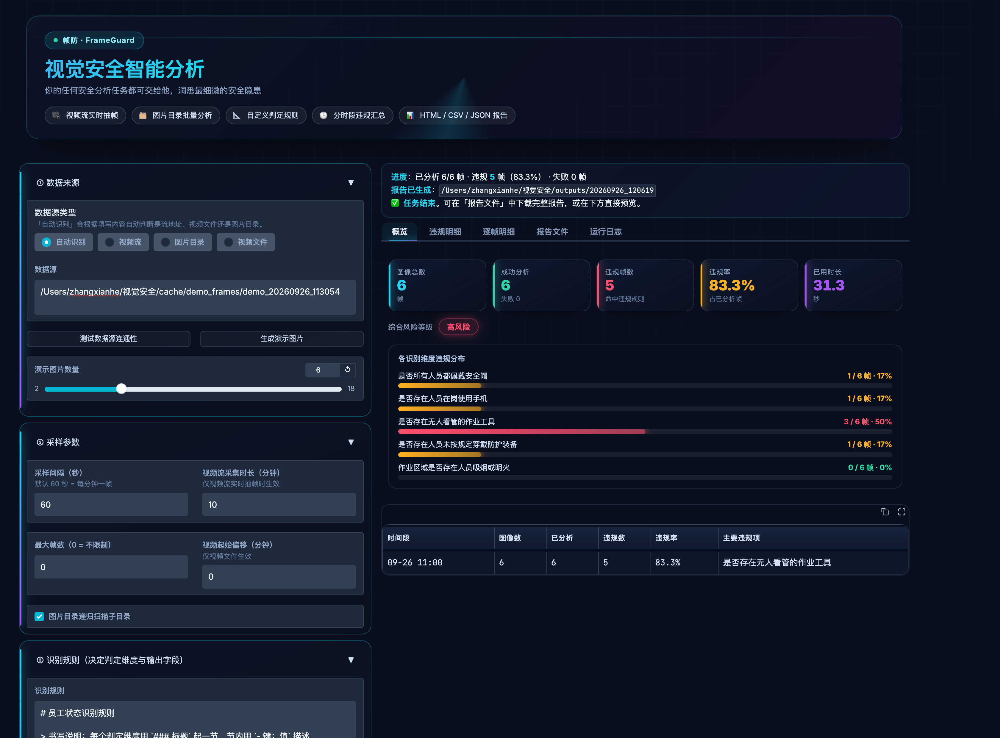
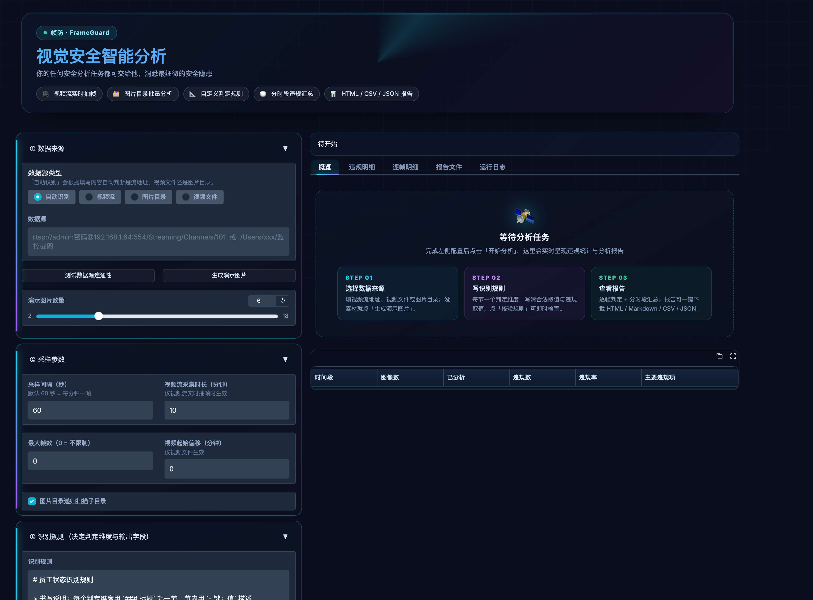
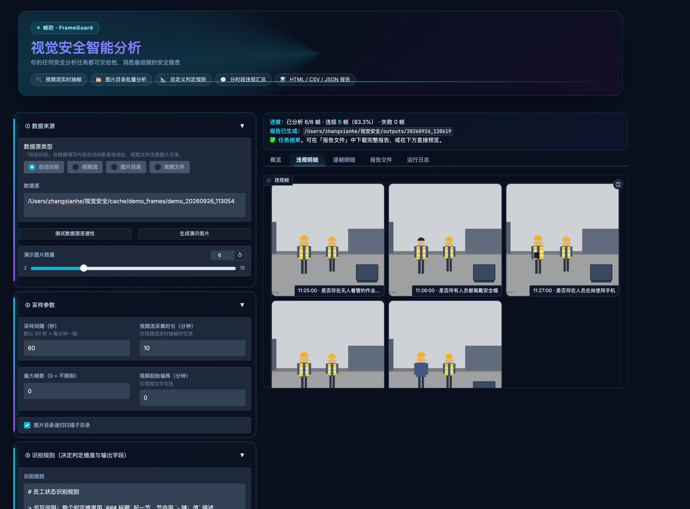
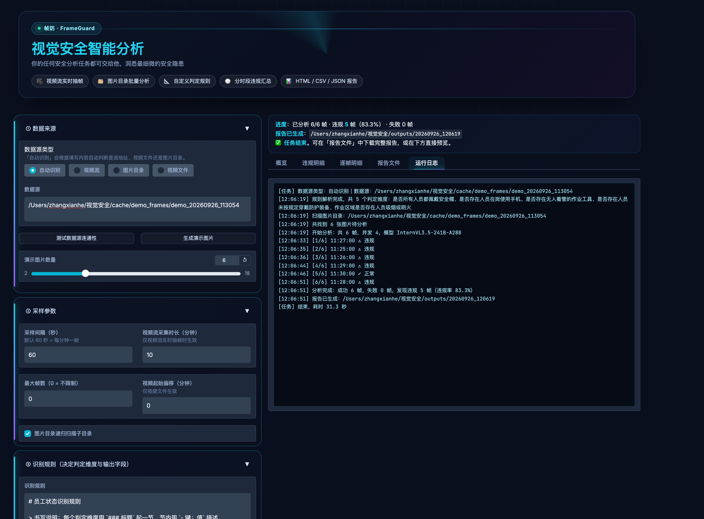

# 帧防 FrameGuard · 视觉安全智能分析

用多模态大模型（默认 InternVL3.5-241B-A28B）逐帧「看懂」监控画面，对照**你自己写的规则**判断是否违规，
并按时间段汇总成一份可交付的监控分析报告。

> 你的任何安全分析任务都可交给他，洞悉最细微的安全隐患。



<details>
<summary>更多界面截图</summary>

| 初始引导 | 违规图像墙 |
| --- | --- |
|  |  |

| 运行日志 |
| --- |
|  |

</details>

---

## 一、快速开始

### 1. 安装（三平台通用）

需要 **Python 3.9+**（推荐 3.10 ~ 3.12）。

```bash
git clone https://github.com/zhangxianhe666/FrameGuard.git
cd FrameGuard

# 创建虚拟环境并安装依赖
python -m venv .venv
.venv/bin/pip install -r requirements.txt          # Windows: .venv\Scripts\pip install -r requirements.txt
```

> `.venv` 是可选但推荐的做法。用别的虚拟环境或系统 Python 也可以，
> 只要该环境装了 `requirements.txt` 里的依赖即可；启动脚本会优先使用项目内的 `.venv`。

### 2. 配置 API Key

Key 不再写死在代码里，二选一：

```bash
cp .env.example .env        # 然后编辑 .env 填入 FRAMEGUARD_API_KEY
```

或者启动后在界面「**⑥ 模型配置 → API Key**」里直接填写。两种方式都行，`.env` 已被 `.gitignore` 忽略。

### 3. 启动

| 平台 | 后台启动 | 停止 |
| --- | --- | --- |
| macOS / Linux | `bash start.sh` | `bash stop.sh` |
| Windows | `start.bat` | `stop.bat` |
| 任意平台 | `python serve.py start` | `python serve.py stop` |

换端口：`bash start.sh --port 8080` ；端口被占用时脚本会**自动顺延**到下一个可用端口并告知你。

其他常用命令：

```bash
python serve.py status     # 查看进程与 HTTP 可达性
python serve.py restart    # 重启
python app.py              # 前台运行（Docker / systemd 场景用这个）
```

然后浏览器打开 **http://127.0.0.1:7891**。
日志在 `cache/server.log`，PID 写在 `cache/server.pid`。

无真实监控画面时，可先点「**生成演示图片**」一键造出合成监控帧，把路径填进数据源即可跑通全流程。

### 4. 环境变量

全部可选，可通过 `.env` 或系统环境变量设置：

| 变量 | 默认值 | 说明 |
| --- | --- | --- |
| `FRAMEGUARD_API_KEY` | 空 | 模型 API Key（也可在界面填） |
| `FRAMEGUARD_BASE_URL` | `https://chat.intern-ai.org.cn/api/v1/` | 模型服务地址 |
| `FRAMEGUARD_MODEL` | `InternVL3.5-241B-A28B` | 模型名称 |
| `FRAMEGUARD_OUTPUT_DIR` | `./outputs` | 报告输出目录，容器部署可指向挂载卷 |
| `FRAMEGUARD_CACHE_DIR` | `./cache` | 抽帧缓存目录 |
| `FRAMEGUARD_HOST` | `127.0.0.1` | 监听地址，局域网访问设为 `0.0.0.0` |
| `FRAMEGUARD_PORT` | `7891` | 监听端口 |

---

## 二、跨平台说明

已在 **macOS** 实测通过；Linux 与 Windows 通过静态审查 + 平台分支实现适配，
下表列出各项差异点及处理方式，便于你在对应平台上快速核验。

| 关注点 | 处理方式 |
| --- | --- |
| 后台常驻 | `serve.py` 分平台实现：POSIX 用双 fork + `setsid`；Windows 用 `DETACHED_PROCESS` + `CREATE_NEW_PROCESS_GROUP` |
| 进程存活检测 | POSIX 用 `os.kill(pid, 0)`；Windows 用 `tasklist` |
| 结束进程 | POSIX 先 `SIGTERM` 再 `SIGKILL`；Windows 用 `taskkill /T /F` |
| 端口探测 | 统一用 `socket.connect_ex`，不依赖 `lsof` |
| 端口占用清理 | POSIX 用 `lsof`；Windows 用 `netstat -ano` 解析 |
| 启动脚本 | macOS/Linux 用 `start.sh` / `stop.sh`；Windows 用 `start.bat` / `stop.bat`（仅含 ASCII 字符，用 `%~dp0` 定位，不受中文路径影响） |
| 视频抽帧 | `opencv-python-headless`，三平台同一套代码；Linux 无需额外装 `libGL` |
| 中文字体 | CSS 字体栈同时包含 `PingFang SC`（macOS）、`Microsoft YaHei`（Windows）、`Noto Sans CJK`（Linux 回退） |
| CSV 编码 | 输出 `utf-8-sig`，Windows Excel 直接打开不乱码 |
| 路径处理 | 全部走 `os.path.join`，无硬编码分隔符；界面示例路径按平台提示 |
| 文件编码 | 所有读写显式 `encoding="utf-8"`，不受 Windows 默认 GBK 影响 |
| 中文文件名 | 仓库内文件全部为 ASCII 命名，避免跨平台归档问题 |

**尚未实测的部分**：Linux 与 Windows 上的实际运行没有在本机验证过（没有对应环境）。
代码里没有使用任何 POSIX 专有模块（`fcntl` / `termios` / `pwd` / `grp` / `os.getuid` 均未出现），
`os.fork` 只出现在有 Windows 分支保护的位置。如遇到问题，先跑 `python serve.py status` 看日志。

**容器部署**（Linux）时用前台模式最省事：

```dockerfile
FROM python:3.11-slim
WORKDIR /app
COPY . .
RUN pip install --no-cache-dir -r requirements.txt
ENV FRAMEGUARD_HOST=0.0.0.0 FRAMEGUARD_PORT=7891
EXPOSE 7891
CMD ["python", "app.py"]
```

---

## 三、界面怎么用

| 区块 | 你要做的事 |
| --- | --- |
| ① 数据来源 | 填 **视频流地址**（`rtsp://…` / `http://…m3u8`）、**视频文件路径**（`.mp4`）或**图片目录路径**。选「自动识别」会自行判断类型。可先点「测试数据源连通性」。 |
| ② 采样参数 | **采样间隔默认 60 秒**（即每分钟取一帧）。视频流需填「采集时长」；视频文件可填「起始偏移」跳过片头。 |
| ③ 识别规则 | 你自己写规则（决定判定维度、字段名、合法取值、违规取值）。点「校验规则」可实时看到解析结果。 |
| ④ 补充说明 | 注入 `{{EXTRA_CONTEXT}}`，例如「夜间红外模式」「配电房禁止无关人员进入」。 |
| ⑤ 提示词模板 | 变量注入式模板，可自行改写。点「查看模板变量」看变量来源。 |
| ⑥ 模型配置 | BaseURL / API Key / 模型名 / **网络代理**，可「测试模型连接」「查询可用模型」「网络环境自检」。 |
| ⑦ 报告设置 | 时间段分组方式（默认按小时）、是否内嵌缩略图。 |
| 右侧结果区 | 概览 / 违规明细（图像墙）/ 逐帧明细 / 报告文件（HTML·MD·CSV·JSON）/ 运行日志。 |

---

## 四、规则怎么写

规则文本是整个判定的唯一依据，也是输出 JSON 的字段定义来源。推荐格式：

```markdown
### 1. 是否所有人员都佩戴安全帽
- 合法取值：是 / 否
- 违规取值：否
- 判定标准：观察图像中所有可见人员的头部，只要存在任意一人未佩戴即判定为「否」；
            所有人员均规范佩戴时判定为「是」。画面中无任何人员时判定为「是」。
```

要点：

- 每个维度一个 `###` 小节；省略「字段名」时直接用小节标题作为字段名。
- **一定要写「违规取值」**。省略时程序会按字段语义自动推断（`是否存在…` → 违规值「是」；`是否都…佩戴` → 违规值「否」），
  并在界面标注为「自动推断」。
- **无人时的默认取值写进「判定标准」**，否则模型可能在画面空场时给出不确定答案。
- 想加维度只需照葫芦画瓢再加一节，字段名即报告中的统计列。

内置示例见 `rules/default_rules.md`（安全帽 / 手机 / 无人看管工具 / 防护装备 / 吸烟明火 五类）。

---

## 五、变量注入机制

提示词模板用 `{{变量}}` 占位，运行时注入。注册的变量见 `core/prompt.py` 的 `VARIABLES`：

| 变量 | 来源 | 用途 |
| --- | --- | --- |
| `{{IMAGE_WORKPLACE_MONITOR}}` | 程序 | 图像占位说明（图片本体以附件形式随消息发送） |
| `{{RECOGNITION_RULES}}` | 用户 | 识别规则全文 |
| `{{FRAME_TIME}}` | 程序 | 本帧采集时间 |
| `{{CAMERA_NAME}}` | 程序 | 点位 / 来源标识 |
| `{{EXTRA_CONTEXT}}` | 用户 | 补充上下文 |

模板未提供的变量会原样保留，并在报告中给出提示。你也可以在模板里新增自定义变量
（未注册的变量将原样保留，界面「查看模板变量」会标注「未注册」）。

---

## 六、目录结构

```
FrameGuard/
├── app.py                    # Gradio 界面入口（前台运行）
├── serve.py                  # 跨平台服务管理器（start / stop / restart / status）
├── start.sh / stop.sh        # macOS / Linux 启动脚本
├── start.bat / stop.bat      # Windows 启动脚本
├── selftest.py               # 端到端自测脚本
├── requirements.txt          # 运行依赖
├── pyproject.toml            # 项目元数据（支持 pip install -e .）
├── .env.example              # 配置模板（复制为 .env 后填写）
├── LICENSE                   # MIT
├── core/
│   ├── config.py             # 配置与数据模型（.env / 环境变量加载）
│   ├── ui_theme.py           # 界面视觉层：主题 / CSS / Hero / 图标 / 引导态
│   ├── prompt.py             # 提示词模板引擎 + 变量注册表
│   ├── rules.py              # 规则解析（字段名 / 合法取值 / 违规取值 / 语义推断）
│   ├── analyzer.py           # 多模态模型调用、图像编码、JSON 提取、违规判定
│   ├── sources.py            # 视频流抽帧 / 视频文件抽帧 / 图片目录采集
│   ├── report.py             # 分时段汇总 + HTML / Markdown / CSV / JSON 报告
│   ├── pipeline.py           # 任务编排（流式进度、可中断）
│   └── demo.py               # 合成演示图像生成
├── prompts/workplace_safety.md   # 默认提示词模板
├── rules/default_rules.md        # 默认识别规则
├── docs/ui_preview/              # 界面预览截图
├── outputs/<时间戳>/              # 每次任务的报告输出（已 gitignore）
└── cache/                        # 抽帧 / 演示图片缓存、服务日志与 PID（已 gitignore）
```

> `outputs/` 与 `cache/` 含实际监控画面与报告，**已被 `.gitignore` 排除**，
> 不会随仓库分发，也不会带进镜像（除非你主动 `COPY`）。

---

## 七、实现要点

- **统一帧抽象**：视频流、视频文件、图片目录最终都变成 `Frame(path, timestamp, source, index)`，
  下游分析完全一致。
- **时间戳来源优先级**：文件名（`20260922_115946` / `2026-09-22_11-59-46` / Unix 时间戳）→ 文件修改时间
  → 视频文件用「修改时间 − 时长」反推录制起点。
- **视频流为真·实时录制**：每 N 秒落一帧，界面实时回传进度，可随时点「停止」。
- **健壮的结构化解析**：自动剥离 ```json 代码块、平衡括号截取、修复尾随逗号与中文引号；
  取值归一（`否（画面中无人）` → `否`）；解析失败自动重试。
- **并发可控**：线程池并发调用，默认 4；图像送达前等比缩放（长边 ≤1280）以控制 token 消耗。
- **报告四件套**：HTML（可直接交付，内嵌违规帧缩略图）、Markdown、CSV（含每个字段的判定列）、
  JSON（含分时段汇总、各维度统计、逐帧结构化结果）。

---

## 八、界面外观

深色「监控指挥中心」风格，全部视觉定义集中在 `core/ui_theme.py`，改一个文件即可换肤。

| 元素 | 做法 |
| --- | --- |
| 底色 | 深空渐变（青 / 紫 / 蓝三处径向光晕）+ 固定网格叠加 |
| 配色 | 主题变量同时写入 light 与 dark 两套值，**浏览器无论深浅色模式观感一致** |
| 深色强制 | `head` 注入一小段 JS 加 `.dark` 类，并用 MutationObserver 防止被切回 |
| Hero | 旋转锥形光晕 + 上下扫描线 + 渐变文字（色相缓慢流动）+ 特性标签 |
| 面板 | `backdrop-filter` 玻璃拟态；展开的折叠项左侧亮起霓虹指示条 |
| 主按钮 | 渐变底 + 光晕阴影 + hover 时高光斜扫 |
| 标签页 | 选中项底部青→紫渐变发光下划线 |
| 数据表 / 图库 | 表头渐变、行悬停高亮；图库缩略图 hover 上浮 + 红色描边 |
| 日志 | JetBrains Mono 等宽 + 青绿字色 + 自定义滚动条 |
| 站点图标 | 启动时用 PIL 现画一个青色盾牌，无需外部图片资源 |

三个状态各有专门的呈现：

- **引导态**：未开始分析时展示三步上手卡片（选数据源 → 写规则 → 看报告）
- **运行中**：扫描线动画 + 呼吸指示灯 + 流光进度条
- **完成态**：KPI 卡片（左侧霓虹描边）+ 风险等级徽章 + 各识别维度违规条形图

想换主色，改 `core/ui_theme.py` 顶部的 `C_CYAN` / `C_BLUE` / `C_VIOLET` 常量即可；
想换整套观感，把 `CSS` 里的 `.hero` / `.gr-accordion` / `button.primary` 三段替换掉。

> 注意：Gradio 6 的 `theme` / `css` / `head` 参数要传给 **`launch()`**，
> 传 `Blocks()` 只会打警告。折叠面板的真实类名是 `.gr-accordion`，
> 标签页是 `div[role="tablist"] button[role="tab"]`；图库与文件组件没有稳定类名，
> 因此统一用 `elem_id` 定位（`#gallery-box` / `#files-box` / `#log-box`）。

---

## 九、注意事项

- API Key **不再写死在代码里**：通过 `.env` 的 `FRAMEGUARD_API_KEY` 或系统环境变量提供，也可直接在界面填写。
  `.env` 已在 `.gitignore` 中，不会被提交；仓库只有一个空的 `.env.example`。
- `outputs/` 与 `cache/` 会存放实际监控画面与判定结果，已排除在版本控制之外，分发或镜像时请自行留意。
- 合成演示图片是抽象图形，用于验证链路连通性；`手机` 一类动作在合成图上识别率有限，真实画面请以实际监控为准。
- 模型判定结果仅作合规巡查的辅助参考，最终结论请以现场核实为准。
- RTSP 需保证本机能访问该地址；若流走 TCP/UDP 需在摄像端确认传输协议。

---

## 十、常见问题

**网页打不开 / 提示无法连接**
1. 先确认服务在不在：`python serve.py status`（三平台通用）。没运行就 `python serve.py start`。
2. 端口被占用了，脚本会**自动顺延**并在输出里告诉你实际端口，用那个端口访问即可；
   也可以手动指定：`python serve.py start --port 8080`。
3. 看日志定位原因：`cache/server.log`（Windows 用记事本打开即可）。
4. 首次访问 Gradio 会加载前端资源，稍等几秒再刷新。

**为什么服务会自己停？**
用 `python app.py` 前台运行、或挂在临时终端里启动时，终端关闭或会话回收会把进程一起带走。
用 `python serve.py start`（或 `start.sh` / `start.bat`）启动即可：POSIX 下走双 fork + `setsid`，
Windows 下走 `DETACHED_PROCESS`，进程彻底脱离会话与进程组，关掉终端也不受影响。

**启动报 `ModuleNotFoundError: No module named 'gradio'`**
当前使用的 Python 环境没装依赖。启动脚本会优先用项目内的 `.venv`，
没有的话建议按「一、快速开始」建一个：
```bash
python -m venv .venv && .venv/bin/pip install -r requirements.txt
```
若用其他虚拟环境，把它的解释器路径传进去：`FRAMEGUARD_PYTHON=/path/to/python python serve.py start`。

**Windows 上双击 `start.bat` 一闪而过**
说明启动失败。请在 `cmd` 里手动执行 `start.bat`，或直接 `python serve.py start` 查看错误信息。

---

**报错 `APIConnectionError: Connection error`**

这说明进程连不上模型服务。按顺序排查：

1. **点界面上的「网络环境自检」** —— 它会列出进程实际看到的代理变量，并真实发一次请求验证连通性，
   结果里会直接告诉你是代理问题还是网络问题。
2. **代理问题（最常见）**：如果这台机器原本的启动环境设了 `HTTP_PROXY` / `HTTPS_PROXY`
   指向一个临时或已失效的代理，进程继承后所有请求都会失败。
   本工具已默认**忽略这些环境变量、直连**，并且启动脚本会主动清掉它们。
   - 如果网络**必须**走代理：在界面「⑥ 模型配置 → 网络代理」里填地址，例如 `http://127.0.0.1:7890`。
   - 如果不需要代理：保持留空即可。
3. **命令行交叉验证**：
   ```bash
   curl -I https://chat.intern-ai.org.cn/api/v1/          # Windows 用 curl.exe 或 PowerShell 的 Invoke-WebRequest
   ```
   curl 能通但界面不通 → 基本可判定是代理或证书问题；curl 也不通 → 是本机网络/DNS/防火墙问题。
4. 确认 BaseURL 末尾带 `/v1/`，API Key 未过期（Key 失效报的是 401，不是 Connection error）。
5. 长视频流分析时若偶发失败，属正常网络抖动：调小并发数、调大「失败重试次数」即可。
